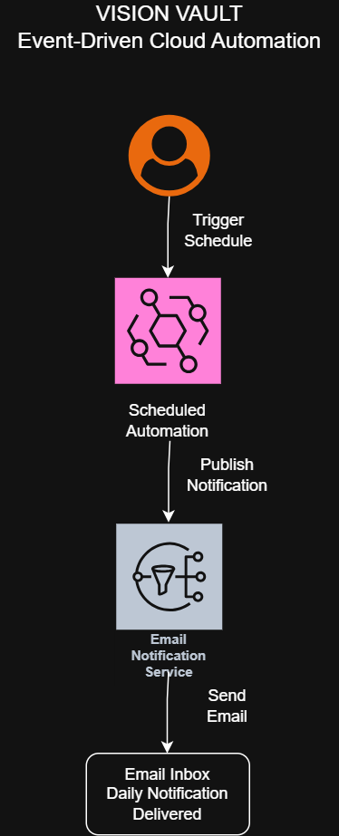
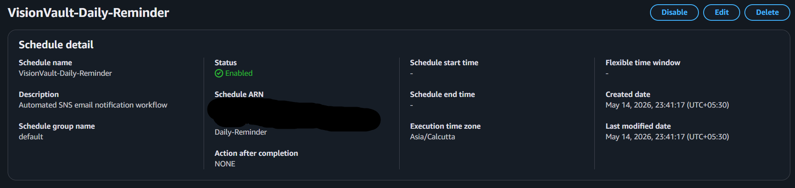
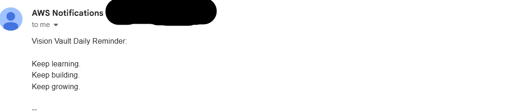

<div align="center">

# 🔔 Vision Vault — Event Automation
### Serverless Cloud Automation with EventBridge & SNS
### *Schedule it. Trigger it. Get notified.* ☁️✨

[]()
[]()
[]()
[]()
[]()

</div>

---

## 🔔 What is this?

> *Set a schedule. The cloud handles everything else — automatically.*

Vision Vault Event Automation is a **fully serverless, event-driven notification workflow** built on AWS. Amazon EventBridge Scheduler triggers on a fixed schedule, publishes to an SNS topic, and delivers automated email notifications — with **zero manual intervention** and **zero servers to manage**. 💜

---

## 🏗️ Architecture

<div align="center">

</div>

```
Amazon EventBridge Scheduler
(Triggers on fixed schedule automatically)
            ↓
      Amazon SNS Topic
(Publishes notification message)
            ↓
   SNS Email Subscription
            ↓
✅ Automated email delivered to inbox
```

---

## 🖥️ Live Proof — It Works!

### 📋 SNS Topic Configuration


> Amazon SNS topic configured and ready — subscriptions set up to receive automated notifications from EventBridge. ✅

---

### 📧 Automated Email Notification Delivered


> Real automated email received from AWS — the full EventBridge → SNS → Email workflow confirmed working end-to-end. 💜

---

## ☁️ Tech Stack

| Service | Role |
|---|---|
| 🗓️ **Amazon EventBridge** | Scheduled event trigger — fires automatically |
| 📢 **Amazon SNS** | Notification topic — publishes to subscribers |
| 📧 **Email Subscription** | End delivery — automated inbox notification |
| 🔐 **AWS IAM** | Secure permissions between services |

---

## ✨ Key Features

- 🗓️ **Scheduled automation** — EventBridge fires on a fixed schedule
- 📢 **Event-driven workflow** — no manual triggers needed
- 📧 **Automated email delivery** — SNS sends notifications instantly
- 🔧 **Zero server management** — fully serverless architecture
- 💰 **AWS Free Tier friendly** — runs within free tier limits
- 🔐 **Secure by design** — IAM controls all service access

---

## 🚀 How It Works

```
Step 1 → EventBridge Scheduler fires on schedule ⏰
Step 2 → Scheduler publishes message to SNS topic 📢
Step 3 → SNS delivers notification to subscribers 📬
Step 4 → Automated email arrives in inbox ✅
Step 5 → Repeat automatically — no human needed 🔄
```

---

## 📂 Project Structure

```
vision-vault-event-automation/
│
├── vision-vault-event-automation.png   # Architecture diagram
├── 2-sns-topic.png.png                 # SNS topic screenshot
├── 3-email-notification.png            # Email delivery proof
└── README.md
```

---

## 💡 What I Learned

- Setting up **Amazon EventBridge Scheduler** for automated triggers
- Configuring **SNS topics and email subscriptions**
- Building **end-to-end serverless notification workflows**
- Understanding **event-driven architecture** patterns on AWS
- Managing **IAM roles** to connect services securely
- Working within **AWS Free Tier** for cost-efficient cloud projects

---

## 🔗 Related Projects

| Project | Stack |
|---|---|
| [Vision Vault — Serverless App](https://github.com/yashvi-create/vision-vault-serverless-app) | Lambda · API Gateway · DynamoDB |
| [Serverless Image Pipeline](https://github.com/yashvi-create) | Lambda · S3 · SNS |
| [Phoenix Gateway](https://github.com/yashvi-create/phoenix-gateway-aws) | CloudFront · S3 · HA Architecture |

---

## 👩‍💻 Built By

<div align="center">

**Yashvi Thakar** — Cloud & DevOps Engineer

[](https://www.linkedin.com/in/yashvithakar/)
[](https://github.com/yashvi-create)

*Build. Automate. Repeat.* ☁️✨

</div>
